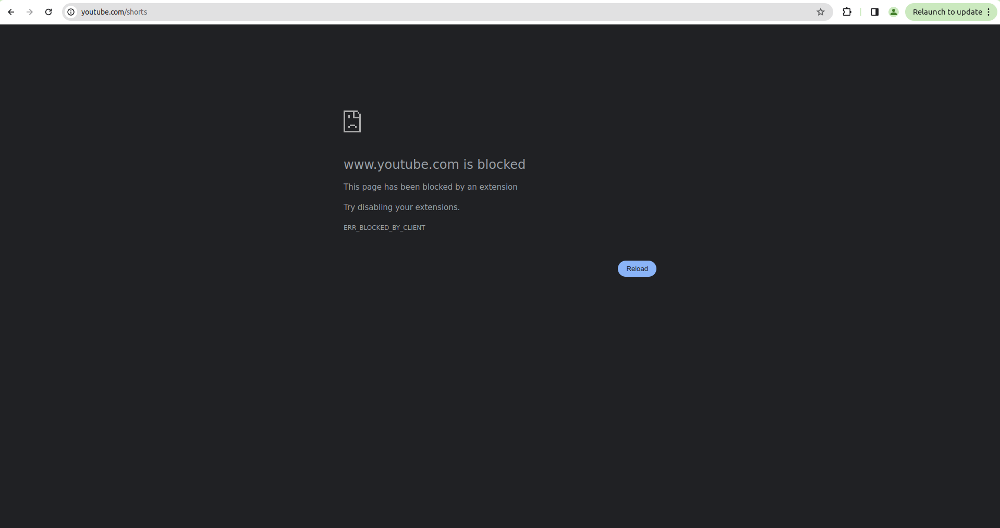

# Youtube Shorts Blocker Extension

## Description

The **Youtube Shorts Blocker** is a Chrome extension designed to prevent access to Youtube Shorts using the `chrome.declarativeNetRequest` API.  

### Features

- Blocks access to Youtube Shorts web pages.
 

## Installation

To install the extension:

1. Download or clone this repository.
2. Open Chrome and go to `chrome://extensions/`.
3. Enable Developer mode.
4. Click on "Load unpacked" and select the extension's folder.

## Usage

Once installed, the extension works silently in the background, blocking requests to Youtube Shorts as defined in `rules_1.json`. Users will be unable to access Youtube Shorts content while the extension is active.

## Permissions

- `declarativeNetRequest`: Required for utilizing the `chrome.declarativeNetRequest` API.
- `declarativeNetRequestFeedback`: Allows the extension to collect feedback for declarativeNetRequest rules.

## Contributing

Contributions are welcome! If you find any issues or want to enhance the extension, feel free to open an issue or pull request.

## License

This project is licensed under the [MIT License](LICENSE).
